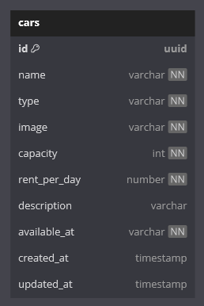

# challenge 4
simple car rest api with orm  to connect with database

### tech stack
- [node js](https://nodejs.org/en)
- [express js](https://expressjs.com/)
- [sequelize](https://sequelize.org/)
- [postgre sql](https://www.postgresql.org/)

### ERD


### end point
- GET /
- GET /cars
- GET /cars/:id
- POST /cars
- PUT /cars/:id
- DELETE /cars/:id

### postman documentation
- [postman documentaion](https://www.postman.com/mhsy/workspace/binar-challenge/collection/29693475-af669e84-e899-4be4-b48b-c027025139f6?action=share&creator=29693475)

### how to run
- clone this repository
```bash
git clone "https://github.com/hasyimashari/binar-challenge.git"
```

- change directory into "challenge-04"
```shell
cd "challenge-04"
```

- install dependecies
```shell
npm i
```

- change config.json with your database
```json
  "development": {
    "username": "db username",
    "password": "db_password",
    "database": "db",
    "host": "localhost",
    "dialect": "postgres"
  }
```

- run migration
```shell
npx sequelize db:migrate
```

- run seeder
```shell
npx sequelize db:seed:all
```

- start server
```shell
npm run dev
```
